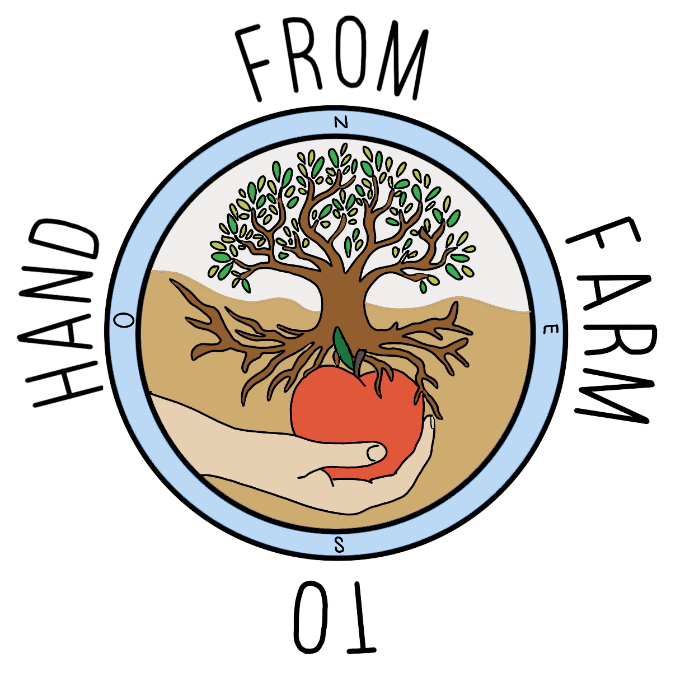
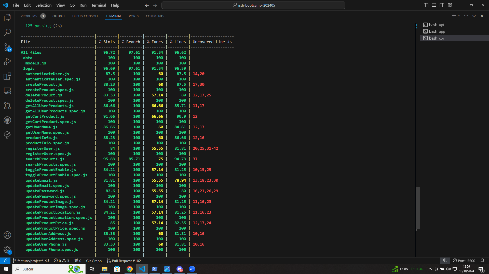

# From Farm To Hand

My Aplication allow people to find near ecologic products from farms directly. People can search te products they wanted near them.

## Functional
The application will allow farmers to add/delete their fruits and vegetables giving them a location where you can find them. On the other hand, it will allow users to find products according to the following specifications that they decide: 
- Distance
- Product name(optional)
- Product type(optional)
Finally you can add the products to your cart. 

### Use Cases

Non registered User/Registered Farmer
- Search by geo and distance and name and type near products
- View product details
- Add or delete product to cart

Farmer
- Add product
- Modify product
- Modify location
- Delete product
- List products
- Modify contact info

### UIUX Design

[Figma](https://www.figma.com/design/EmWrgzKY9cybbgUbxXlXVk/From--farm-to-hand-definitive?t=CIzbjwQeMFNxnZO2-0)

## Tecnical

### Blocks

- App (user interface)
- API (core logic)
- DB (data storage)

### Packages

- api (server)
- cor (core logic dependency to api)
- com (common dependencies to api and app)
- app (client)
- doc (project documentation)

### Technologies

- HTML / CSS / JS
- Node
- Express
- React
- Mongo/Mongoose (GeoJSON)
- Tailwindcss
- Leaflet
- Bcrypt
- JWT

### Data Model
User
- id (string)
- name (string)
- surname (string)
- email (string)
- phone (string)
- address (string)
- password (string)

Product
- id (string)
- farmer(User.id)
- name (string)
- type(string, optional)
- minprice(number)
- maxprice(number)
- image(string)
- location ([number, number])
- enabled (boolean, default true)

### Test Coverage

