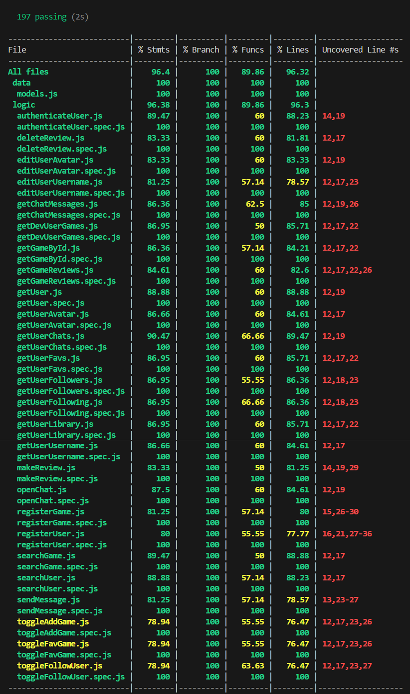

# The G-HUB

A hub for gamers and developers to play or upload videogames

## Functional

### Use Cases

**Regular/Dev User**
- list library
- list favourites
- add game to library
- add game to favourites
- search games (by name)
- search users (by name)
- view game details
- play/download game
- add review
- delete review
- follow user
- chat with user
- view user profile

**Dev User**
- register game to site
- list own game

### UIUX Design

[Figma](https://www.figma.com/files/team/1381930055088856376/project/256028731/Project?fuid=1381930053009727034)

## Tecnical

### Blocks

- App (user interface)
- API (core logic)
- DB (data storage)

### Packages

- api (server)
- cor (core logic dependency to api)
- com (common dependencies to api and app)
- app (client)
- doc (project documentation)

### Technologies

- HTML / CSS  / JS
- Node
- Express
- React
- Vite
- Mongodb
- Mongoose
- JWT
- Bcrypt
- Tailwindcss

### Data Model

**User**
- id (auto)
- email (string)
- username (string)
- password (string)
- avatar (string)
- role (string, enum: regular or dev)
- library ([Game.id])
- favs ([Game.id])
- games ([Game.id], optional)
- following ([User.id])
- followers ([User.id])

**Game**
- id (auto)
- enabled (boolean)
- author (User.id)
- name (string)
- image (string)
- description (string)
- link (string)
- date (Date)

**Review**
- id (auto)
- author (User.id)
- game (Game.id)
- rate (number, optional)
- comment (string)
- date (Date)

**Chat**
- id (auto)
- participants ([User.id])
- messages (Message.id)
- date (Date)

**Message**
- id (auto)
- author (User.id)
- content (string)
- date (Date)

### Test Coverage

