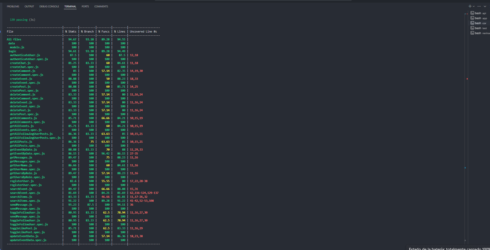

# Scene

Scene is an application designed to connect musicians, bands, concert venues, promoters, and record labels within the underground scene. The primary objective is to create and promote concerts, as well as to facilitate networking and connections among the various participants in the music scene.

## Functional

The application offers a platform for different user profiles to interact, collaborate, and stay informed about musical events through:

- A main section where all followed users are listed and where you can create, modify, and delete your own posts, as well as react to, save, and comment on others' posts.

- An interactive calendar where events can be viewed, created, modified, and deleted.

- A search tool to find events by date, geolocation, band, or music genre.

- A directory for each role within the app, allowing users to connect with them or send messages.

### Use Cases

User
- Create post
- List posts
- Delete own post
- View event calendar
- Create event
- List events
- Search events by location, title and description
- Modify own event
- Delete own event
- Follow user
- Search users and posts
- List following users
- List bands
- List venues
- List promoters
- List labels
- Add comments in a post
- Delete own comment in a post
- Toggle like post
- Open chat
- Send messages

### UIUX Design
[Figma](https://www.figma.com/design/ENeHGUGHQy8gNxY00fCLsa/Untitled?node-id=1-710&t=TEnsDeO22H759zz5-0)

## Technical

### Blocks

- App (user interface)
- API (core logic)
- DB (data storage)

### Packages

- api (server)
- cor (core logic dependency to api)
- com (common dependencies to api and app)
- app (client)
- doc (project documentation)

### Technologies

- HTML / CSS  / JS
- Node
- Express
- React
- Mongodb
- Mongoose
- Bcrypt
- Tailwind
- JWT

### Data Model

User 
- id (auto)
- name (string)
- username (string)
- role (string, enum: regular | band | label | promoter | venue)
- email (string)
- password (string)
- avatar (string)
- messages ([User.message])
- following ([User.id])

Post
- id (string)
- author (User.id)
- image (string, optional)
- text (string, optional)
- date (Date)
- likes ([User.id])

Event
- id (string)
- author (User.id)
- image (string, optional)
- title (string)
- description (string)
- location ([Number, Number])
- startDate (Date)
- startTime (string)
- tickets (string)
- date (Date)

Comment
- id (auto)
- text (string)
- author (User.id)
- post (Post.id)
- date (Date)

Point
- type (string)
- coordinates ([Number])

Chat
- id (auto)
- participants ([User.id])
- messages ([Message.id])
- date (Date)

Message
- id (auto)
- author (User.id)
- text (string)
- date (Date)
- chat (Chat.id)

### Test Coverage

