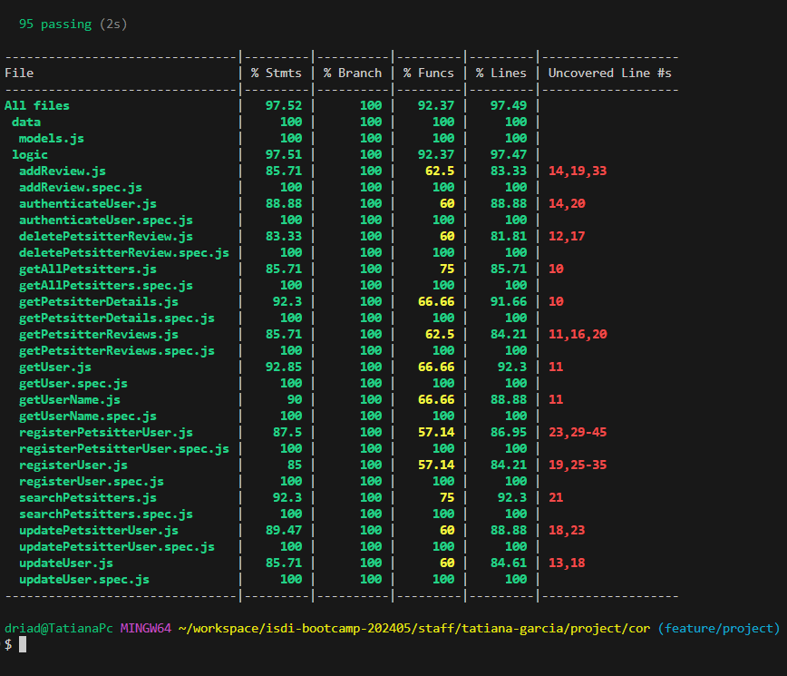

# Exoticus

Exoticus is an application where you can contact the nearest exotic pet daycare centers to take care of your pets when you need it.

## Functional

The application is designed so that you can use it without the need to register. It includes:

 - A search tool that allows you to find daycare centers by filtering by city and type of animal, or simply by city.

 - An information section where you can view the main details of each daycare center.

 - A registration option, which allows you to access contact details for the daycare centers and write reviews once registered.

 - Additionally, if you have any questions, you can contact us through the email provided in the application.

### Use Cases
**Anonimous Users**
 - list petsitters by city and animal
 - view petsitter's detail
 - view admin contact
 
 **Petsitter user**
 - list petsitters by city and animal
 - view petsitter's detail with contact info
 - view admin contact 
 - update own details

**Regular user**
 - list petsitters by city and animal
 - view petsitter's detail with contact info
 - view admin contact
 - add review to petsitter
 - update own details
 - delete review from petsitter

### UIUX Design

[Figma](https://www.figma.com/design/A9qXoEbUGl258DXtERKh40/Untitled?node-id=0-1&t=7FmmZaRi3wCYhaF2-0)

## Tecnical

### Blocks
- App (user interface)
- API (core logic)
- DB (data storage)

### Packages
- api (server)
- cor (core logic dependency to api)
- com (common dependencies to api and app)
- app (client)
- doc (project documentation)

### Technologies

- HTML / CSS / JS
- Node
- Express
- React
- Mongodb / Mongoose
- TailwindCSS
- Bcrypt
- JWT

### Data Model

**User**
 - id (auto)
 - name (string)
 - surname (string, optional)
 - email (string)
 - contact email (string, opcional)
 - link page (string, opcional)
 - phone (string, optional)
 - city (string, optional)
 - password (string)
 - description (string, optional)
 - image (string, optional)
 - role ( string, enum: petsitter or regular)
 - animals([string], optional)
 
 **Review**
  - id (auto)
  - author (User.id)
  - petsitter (User.id)
  - rate (number)
  - date (Date)
  - comment (string, optional)

  ### Test Coverage

  